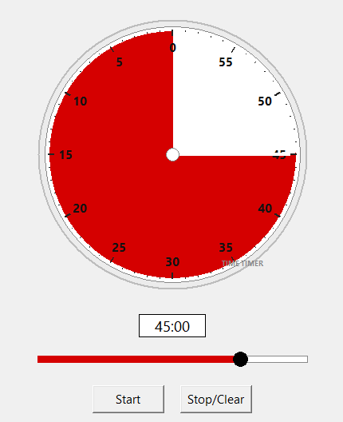

# Time Timer



A small desktop clone of the Time Timer countdown clock.

## Run

Double-click **`TimeTimer.exe`** — no install required.

- Slider drag / mouse wheel — set time (snaps to 1 min)
- Number box (`MM:SS` or `MM`) — type a value
- **Start** — counts down; window pinned on top
- **Stop/Clear** — pauses; press again to reset
- On finish — beep + window pulses light red

## Rebuild

```
build.bat
```

Requires Python 3 and PyInstaller (`pip install --user pyinstaller`).

## Platform

`TimeTimer.exe` is **Windows x64 only**.

The source (`timer.py`) also runs on macOS / Linux via `python timer.py`,
but the end-of-timer beep is Windows-only (uses `winsound`); everything
else works cross-platform.
